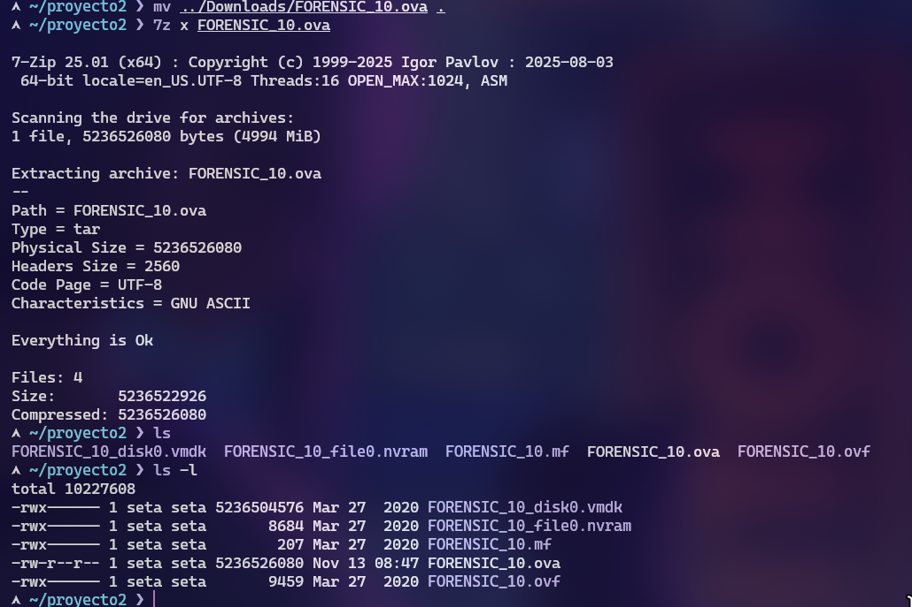
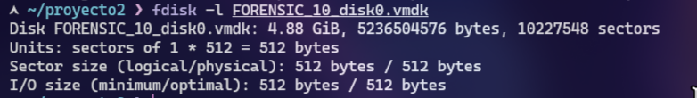
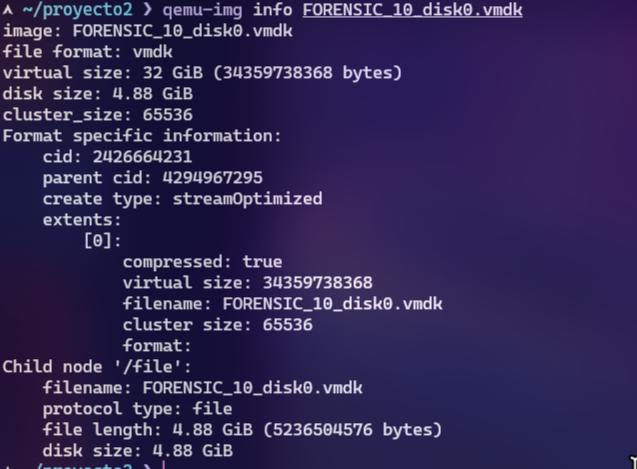
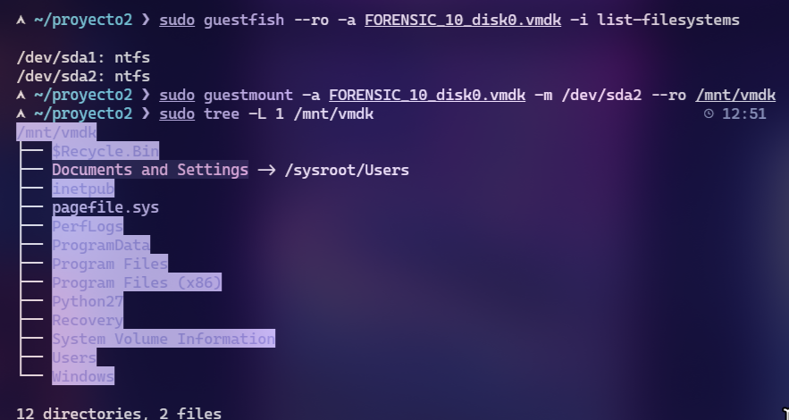

# INTRODUCCIÓN

Este informe forense detalla el análisis exhaustivo de una máquina Windows 7 comprometida entregada en formato OVA. La totalidad del proceso se divide en dos fases principales:

1. **Pruebas y análisis fuera de la máquina** (análisis estático sin ejecución del sistema).
2. **Pruebas dentro de la máquina** (análisis dinámico o live forensics), que se desarrollará más adelante.

La presente sección corresponde exclusivamente a la **PARTE A – Análisis Forense Fuera de la Máquina**, donde se examina la evidencia sin arrancar el sistema operativo comprometido. Esta fase garantiza la preservación de la integridad del sistema investigado y permite extraer artefactos críticos antes de que cualquier cambio pueda ocurrir.

A continuación se documentan todas las herramientas, comandos y procedimientos aplicables en un flujo forense completo.

---
# 1. Recolección de evidencias
# PARTE A – PRUEBAS Y COMANDOS FUERA DE LA MÁQUINA (ANÁLISIS ESTÁTICO)

## A.1. Cálculo de hashes del archivo OVA/VMDK
```
sha256sum FORENSIC_10.ova
```
Primero comprobar el hash de la máquina
``
daf0ef5255d98276a6912a53611db5c0cbf2cccbb49a180dd7fcc0f95e14930c  FORENSIC_10.ova
``


Sacamos el archivo .vmdk que contiene la información de la OVA



### Hashes del .ova y su contenido
```
sha256sum *
sha1sum *
md5sum *
```

| Archivo                 | SHA256                                                           | MD5                              | SHA1                                     |
| ----------------------- | ---------------------------------------------------------------- | -------------------------------- | ---------------------------------------- |
| FORENSIC_10.ova         | daf0ef5255d98276a6912a53611db5c0cbf2cccbb49a180dd7fcc0f95e14930c | 45ea13bf91ad8393f5684edf588db60a | bb4a7c2842c21947863c0f05d7c015630ffbf6e2 |
| FORENSIC_10_disk0.vmdk  | d5823f36d01b807888275d8b21f41c1e427d2e59d610177722416702b025a6ff | 3c21518c46518550689291ed10c1ee5e | ec69cc76452c87c01e5c6414a0f4c549b49ec5c5 |
| FORENSIC_10_file0.nvram | 2635893c1b7270edfdba1d5baa5a63fb4a9c2170caa2614639c190d0f5aac2f6 | d4b147f6890861f82d1a2df0f2062602 | 7577d5db9380ca968ba24c50fdc5ef8ed25500be |
| FORENSIC_10.mf          | bb9afac37ffbdfe8af4228a3af223b868e577d87876a683ecca9bf8e0992a402 | fe907f70ee42591a34c6a82331301e11 | bc75c7d044a3123a34b40247ed3da510c327ae5c |
| FORENSIC_10.ovf         | 2c36a2c71aee1189e14255e6127122ef0acb4132f805e7f57e5092f43d4e7f33 | 0f8ee0089360f3d7497dd0b2acdabad1 | fa1914cbb8c9e4322fcabbe909ee9c251435a009 |

---

## A.2 Análisis del Disco

### A.2.1 Información del disco

```
fdisk -l disco.vmdk
```


```
qemu-img info disco.vmdk 
```



### A.2.2 Montaje del disco solo lectura
```
sudo guestfish --ro -a FORENSIC_10_disk0.vmdk -i list-filesystems
```
```
sudo guestmount -a FORENSIC_10_disk0.vmdk -m /dev/sda2 --ro /mnt/vmdk
```
### A.2.3 Reconstrucción de estructura del sistema de archivos


```
sudo tree -L 1 /mnt/vmdk
```



---


## A.3 Extracción Masiva de Artefactos

### A.3.1 Registry hives

```
cp /mnt/vmdk/Windows/System32/config/SYSTEM ./registry/
cp /mnt/vmdk/Windows/System32/config/SAM ./registry/
cp /mnt/vmdk/Windows/System32/config/SECURITY ./registry/
cp /mnt/vmdk/Windows/System32/config/SOFTWARE ./registry/
cp /mnt/vmdk/Users/*/NTUSER.DAT ./registry/
cp /mnt/vmdk/Users/*/AppData/Local/Microsoft/Windows/UsrClass.dat ./registry/
```

### A.3.2 Prefetch

```
cp /mnt/vmdk/Windows/Prefetch/*.pf ./prefetch/
```

### A.3.3 Event Logs

```
cp /mnt/vmdk/Windows/System32/winevt/Logs/*.evtx ./logs/
```

### A.3.4 Archivos temporales

```
cp -R /mnt/vmdk/Users/Administrador/AppData/Local/Temp/* tmp/
```

### A.3.5 Archivos de inicio y persistencia

```
cp /mnt/vmdk/ProgramData/Microsoft/Windows/Start\ Menu/Programs/Startup/* ./startup/
cp /mnt/vmdk/Users/*/AppData/Roaming/Microsoft/Windows/Start\ Menu/Programs/Startup/* ./startup/
```

---

## A.4 Análisis Profundo de Artefactos del Sistema

### A.4.1 Master File Table (MFT)

El Master File Table (MFT) es la estructura central del sistema de archivos NTFS. Contiene un registro para cada archivo y carpeta del volumen, incluyendo metadatos críticos como nombres, rutas, timestamps MACB, permisos, tamaño, flags y los data runs que indican dónde está almacenado cada archivo en el disco. Incluso los archivos borrados conservan su entrada en el MFT hasta que es reutilizada, lo que convierte al MFT en una fuente fundamental de evidencia en análisis forense.

```
qemu-img convert -O raw disco.vmdk disco.raw

mmls disco.raw

istat -o 2048 disco.raw 0-128-1
```


### A.4.2 Jump Lists

```
cp -R /mnt/vmdk/Users/*/AppData/Roaming/Microsoft/Windows/Recent/AutomaticDestinations ./jump_lists/
```


### A.4.3 Análisis de LNK (accesos directos)

```
cp /mnt/vmdk/Users/*/AppData/Roaming/Microsoft/Windows/Recent/*.lnk ./lnk/

cp  /mnt/vmdk/Users/Administrador/Desktop/* lnk/
```

---

## A.6 Extracción de Archivos Sospechosos


Durante el análisis del sistema de archivos montado desde la imagen
`disco.raw`, se identificó en el directorio:
``/mnt/vmdk/Users/Administrador/Desktop/``
la presencia de **scripts Python maliciosos y herramientas orientadas a
la explotación de vulnerabilidades**, lo cual constituye una fuerte
evidencia de actividad maliciosa o no autorizada dentro del sistema
analizado.

### 1. Script malicioso encontrado: `crea_user.py`

El archivo ubicado en:
``/Users/Administrador/Desktop/crea_user.py``
contiene un **exploit completo para Easy File Sharing Web Server 7.2**,
incluyendo:

-   Payload personalizado generado con msfvenom
-   Cadena ROP para bypass de DEP
-   Shellcode que crea un usuario no autorizado ("ihacklabs")
-   Código para envío directo del exploit a un servidor remoto

### Indicadores clave de malicia

1.  **Exploit conocido públicamente**
2.  **Uso explícito de msfvenom**
3.  **ROP Chain avanzada creada con mona.py**
4.  **Shellcode empaquetado y ofuscado**
5.  **Comportamiento directo de ataque** mediante envío del payload.


### 2. Activador KMS

KMSPico es una herramienta ilegal utilizada para activar sin licencia productos de Microsoft como Windows u Office.

Imita el funcionamiento del Key Management Service (KMS), un mecanismo legítimo de activación por volumen usado por empresas.

En un entorno corporativo, un servidor KMS interno valida periódicamente las licencias.
KMSPico emula ese servidor y fuerza a Windows/Office a considerarse activados.


Aunque muchos usuarios creen que es simplemente una herramienta de activación, desde la perspectiva de ciberseguridad y análisis forense es software malicioso o potencialmente indeseado (PUA) por múltiples razones:

* Requiere privilegios de administrador

* Modificar archivos del sistema

* Instalar servicios

* Registrar tareas programadas

* Alterar claves críticas del Registro


Esto significa que cualquier componente malicioso que incluya tendrá permisos completos sobre el sistema.

---

## A.7 Preservación y Hashing Final

```
sha256sum artefactos/* > sha256_hashes.txt
sha1sum artefactos/* > sha1_hashes.txt
md5sum artefactos/* > md5_hashes.txt

```

---

## A.10 Cadena de Custodia

* Hora exacta de adquisición
* Medio de almacenamiento
* Hashes verificados antes/después
* Ubicación actual de la evidencia

---
