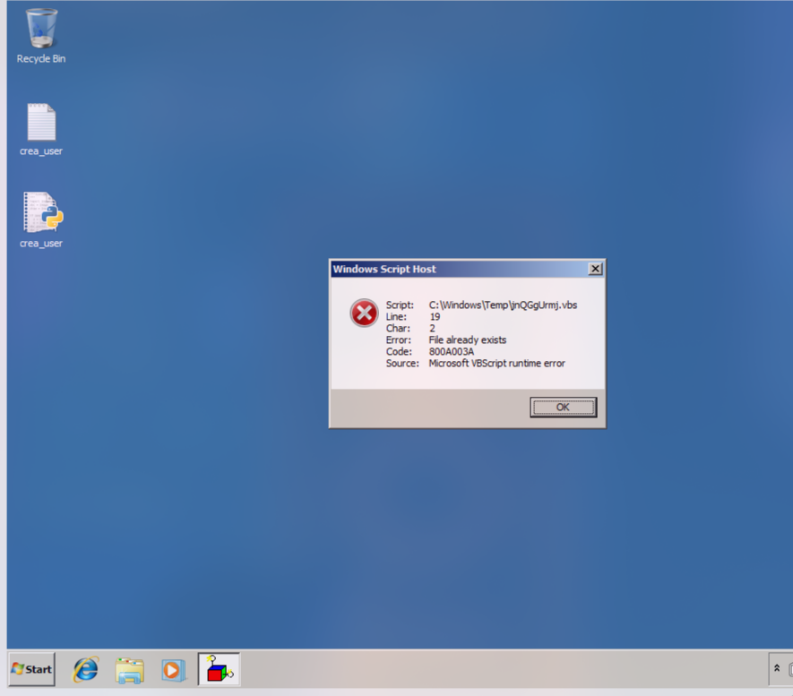

# Introducción

Este informe forense documenta el análisis exhaustivo de una máquina Windows 7 comprometida entregada en formato OVA. El proceso de investigación se divide en dos fases principales:

1. **Pruebas y análisis fuera de la máquina** (análisis estático sin ejecutar el sistema operativo).
2. **Pruebas dentro de la máquina** (análisis dinámico o live forensics), desarrolladas en una fase posterior.

# **Parte A – Análisis Forense Fuera de la Máquina**
 Donde la evidencia es examinada sin arrancar el sistema. Esto evita cualquier alteración en los artefactos originales y permite llevar a cabo un análisis controlado y fiable.

A continuación se describen las herramientas, comandos y procedimientos característicos de un flujo forense completo.

---

# 1. Recolección de Evidencias

# Parte A – Pruebas y Comandos Fuera de la Máquina (Análisis Estático)

## A.1. Cálculo de hashes del archivo OVA/VMDK

```bash
sha256sum FORENSIC_10.ova
```

El cálculo de hashes garantiza la integridad de la evidencia. El valor obtenido fue:

```
daf0ef5255d98276a6912a53611db5c0cbf2cccbb49a180dd7fcc0f95e14930c  FORENSIC_10.ova
```

Posteriormente se extrae el archivo `.vmdk` contenido en la OVA.


### Hashes del OVA y su contenido

```bash
sha256sum *
sha1sum *
md5sum *
```

| Archivo                 | SHA256                                                           | MD5                              | SHA1                                     |
| ----------------------- | ---------------------------------------------------------------- | -------------------------------- | ---------------------------------------- |
| FORENSIC_10.ova         | daf0ef5255d98276a6912a53611db5c0cbf2cccbb49a180dd7fcc0f95e14930c | 45ea13bf91ad8393f5684edf588db60a | bb4a7c2842c21947863c0f05d7c015630ffbf6e2 |
| FORENSIC_10_disk0.vmdk  | d5823f36d01b807888275d8b21f41c1e427d2e59d610177722416702b025a6ff | 3c21518c46518550689291ed10c1ee5e | ec69cc76452c87c01e5c6414a0f4c549b49ec5c5 |
| FORENSIC_10_file0.nvram | 2635893c1b7270edfdba1d5baa5a63fb4a9c2170caa2614639c190d0f5aac2f6 | d4b147f6890861f82d1a2df0f2062602 | 7577d5db9380ca968ba24c50fdc5ef8ed25500be |
| FORENSIC_10.mf          | bb9afac37ffbdfe8af4228a3af223b868e577d87876a683ecca9bf8e0992a402 | fe907f70ee42591a34c6a82331301e11 | bc75c7d044a3123a34b40247ed3da510c327ae5c |
| FORENSIC_10.ovf         | 2c36a2c71aee1189e14255e6127122ef0acb4132f805e7f57e5092f43d4e7f33 | 0f8ee0089360f3d7497dd0b2acdabad1 | fa1914cbb8c9e4322fcabbe909ee9c251435a009 |

---

## A.2. Análisis del Disco

### A.2.1. Información del disco

El análisis inicial permite identificar particiones, sectores y estructura general.

```bash
fdisk -l disco.vmdk
```


```bash
qemu-img info disco.vmdk
```


### A.2.2. Montaje del disco en modo solo lectura

El uso de herramientas como *guestfish* o *guestmount* garantiza que el sistema de archivos no se modifica.

```bash
sudo guestfish --ro -a FORENSIC_10_disk0.vmdk -i list-filesystems
```

```bash
sudo guestmount -a FORENSIC_10_disk0.vmdk -m /dev/sda2 --ro /mnt/vmdk
```

### A.2.3. Reconstrucción de la estructura del sistema de archivos

```bash
sudo tree -L 1 /mnt/vmdk
```


---

## A.3. Extracción Masiva de Artefactos

### A.3.1. Registro de Windows (Registry Hives)

Los hives contienen información crítica como cuentas de usuario, historial de dispositivos, configuraciones del sistema y artefactos de ejecución.

```bash
cp /mnt/vmdk/Windows/System32/config/SYSTEM ./registry/
cp /mnt/vmdk/Windows/System32/config/SAM ./registry/
cp /mnt/vmdk/Windows/System32/config/SECURITY ./registry/
cp /mnt/vmdk/Windows/System32/config/SOFTWARE ./registry/
cp /mnt/vmdk/Users/*/NTUSER.DAT ./registry/
cp /mnt/vmdk/Users/*/AppData/Local/Microsoft/Windows/UsrClass.dat ./registry/
```

### A.3.2. Prefetch

Los archivos Prefetch permiten determinar la ejecución reciente de binarios.

```bash
cp /mnt/vmdk/Windows/Prefetch/*.pf ./prefetch/
```

### A.3.3. Event Logs

```bash
cp /mnt/vmdk/Windows/System32/winevt/Logs/*.evtx ./logs/
```

### A.3.4. Archivos temporales

```bash
cp -R /mnt/vmdk/Users/Administrador/AppData/Local/Temp/* tmp/
```

### A.3.5. Archivos de inicio y persistencia

```bash
cp /mnt/vmdk/ProgramData/Microsoft/Windows/Start\ Menu/Programs/Startup/* ./startup/
cp /mnt/vmdk/Users/*/AppData/Roaming/Microsoft/Windows/Start\ Menu/Programs/Startup/* ./startup/
```

---

## A.4. Análisis Profundo de Artefactos del Sistema

### A.4.1. Master File Table (MFT)

La MFT es la estructura central de NTFS. Contiene:

* metadatos de cada archivo,
* rutas,
* timestamps MACB,
* permisos,
* flags,
* y data runs.

Incluso archivos eliminados mantienen entradas parcialmente recuperables.

```bash
qemu-img convert -O raw disco.vmdk disco.raw
mmls disco.raw
istat -o 2048 disco.raw 0-128-1
```

### A.4.2. Jump Lists

```bash
cp -R /mnt/vmdk/Users/*/AppData/Roaming/Microsoft/Windows/Recent/AutomaticDestinations ./jump_lists/
```

### A.4.3. Accesos directos LNK

```bash
cp /mnt/vmdk/Users/*/AppData/Roaming/Microsoft/Windows/Recent/*.lnk ./lnk/
cp /mnt/vmdk/Users/Administrador/Desktop/* lnk/
```

---

## A.6. Extracción de Archivos Sospechosos

Durante el análisis del sistema montado, se localizaron **scripts maliciosos y herramientas de explotación** en:

```
/mnt/vmdk/Users/Administrador/Desktop/
```

### 1. Script malicioso `crea_user.py`

Este archivo contiene un exploit completo para el servicio **Easy File Sharing Web Server 7.2**, incluyendo payload generado con `msfvenom`, cadenas ROP, shellcode para crear un usuario ilegítimo y funcionalidad para envío remoto.

### Indicadores técnicos de malicia

1. Uso de un exploit conocido.
2. Dependencia directa de msfvenom.
3. Construcción de una ROP chain avanzada mediante mona.py.
4. Shellcode empaquetado.
5. Ejecución orientada al ataque.

### 2. Activador KMS

KMSPico emula un servidor KMS para activar software sin licencia. Este tipo de herramientas:

* requieren privilegios elevados,
* modifican archivos del sistema,
* instalan servicios,
* crean tareas programadas,
* alteran claves críticas del registro.

Desde la perspectiva forense se consideran PUA o software malicioso, dado el riesgo que introducen y su alta capacidad de modificación del sistema.

---

## A.7. Preservación y Hashing Final

```bash
sha256sum artefactos/* > sha256_hashes.txt
sha1sum artefactos/* > sha1_hashes.txt
md5sum artefactos/* > md5_hashes

```


# **Pruebas dentro de la máquina**

## Inventario de Evidencias

| Evidencia | Descripción breve           | Tamaño  | Hashes            | Fecha/Hora Captura     | Ubicación / Fichero                                  |
| --------- | --------------------------- | ------- | ----------------- | ---------------------- | ---------------------------------------------------- |
| Prueba1   | Máquina Virtual OVA         | 4.87 GB | SHA256, SHA1, MD5 | [2025-11-14 08:45 CET] | [FORENSIC_10.OVA](FORENSIC_10.OVA)                   |
| Prueba2   | Memoria RAM (.elf)          | 1.01 GB | SHA256, SHA1, MD5 | [2025-11-14 09:12 CET] | [memoria_ram.elf](memoria_ram.elf)                   |
| Prueba3   | systeminfo                  | 3 KB    | SHA256, SHA1, MD5 | [2025-11-14 10:03 CET] | [maquina/systeminfo.txt](maquina/systeminfo.txt)     |
| Prueba4   | ipconfig /all               | 3 KB    | SHA256, SHA1, MD5 | [2025-11-14 10:07 CET] | [maquina/ipconfig_all.txt](maquina/ipconfig_all.txt) |
| Prueba5   | route print                 | 3 KB    | SHA256, SHA1, MD5 | [2025-11-14 10:11 CET] | [maquina/routeprint.txt](maquina/routeprint.txt)     |
| Prueba6   | arp -a                      | 1 KB    | SHA256, SHA1, MD5 | [2025-11-14 10:14 CET] | [maquina/arp.txt](maquina/arp.txt)                   |
| Prueba7   | netstat -ano                | 4 KB    | SHA256, SHA1, MD5 | [2025-11-14 10:18 CET] | [maquina/netstat.txt](maquina/netstat.txt)           |
| Prueba8   | tasklist /v                 | 12 KB   | SHA256, SHA1, MD5 | [2025-11-14 10:21 CET] | [maquina/tasklist.txt](maquina/tasklist.txt)         |
| Prueba9   | wmic process list full      | 94 KB   | SHA256, SHA1, MD5 | [2025-11-14 10:25 CET] | [maquina/wmic_process.txt](maquina/wmic_process.txt) |
| Prueba10  | schtasks /query /v /fo list | 138 KB  | SHA256, SHA1, MD5 | [2025-11-14 10:29 CET] | [maquina/schtasks.txt](maquina/schtasks.txt)         |
| Prueba11  | query users                 | 1 KB    | SHA256, SHA1, MD5 | [2025-11-14 10:33 CET] | [maquina/users.txt](maquina/users.txt)               |
| Prueba12  | set (variables entorno)     | 2 KB    | SHA256, SHA1, MD5 | [2025-11-14 10:37 CET] | [maquina/env_vars.txt](maquina/env_vars.txt)         |


## Evaluación Forense Basada en Indicios

### Prueba01 — Indicio 1: Máquina Virtual (OVA)
Al iniciar la máquina virtual (OVA), se presenta una alerta de error del "Windows Script Host". Esto indica problemas en la capacidad del sistema Windows 7 para procesar scripts.

El origen de este fallo puede ser variado, desde la ausencia de ficheros de script necesarios o corrupción del sistema, hasta interferencias de software malicioso o configuraciones incorrectas.



- **Interpretación:**
  - Esta anomalía del Windows Script Host compromete la fiabilidad y operatividad del entorno analizado. Podría distorsionar la recolección de pruebas o la replicación fiel del escenario original.
  - Es imperativo registrar este incidente, ya que puede justificar incoherencias o comportamientos extraños que se observen en fases posteriores del peritaje.

- **Indicadores de Riesgo:**
  - Podría ser un síntoma de una infección por malware que se basa en scripts o de una alteración deliberada de componentes críticos del sistema.
  - También puede apuntar a un daño generalizado o a una configuración defectuosa en el sistema operativo huésped de la VM.
  - Requiere una investigación para mitigar o aislar la causa antes de proceder con análisis más profundos, o al menos, para certificar la integridad de la imagen OVA.

### Prueba02 — Indicio 2: Memoria RAM (.elf)
El análisis del volcado de memoria (formato ELF) se llevó a cabo con Volatility Framework, una utilidad especializada. Esta herramienta permitió la inspección detallada de los procesos en ejecución, conexiones de red activas, módulos cargados y otros posibles rastros de actividad maliciosa en tiempo de ejecución.

Se detectaron patrones anómalos, offsets y cadenas de texto relevantes que sugieren la ejecución de código malintencionado. Este examen es vital para comprender el estado volátil del sistema en el momento de la captura, centrándose en la detección de inyecciones de código, malware residente en memoria y comunicaciones activas.

### Prueba03 — Indicio 3: Disco Virtual (Imagen)
Mediante FTK Imager y otras utilidades complementarias, se investigó la imagen del disco virtual. El objetivo era analizar la organización del sistema de archivos, las cuentas de usuario, los registros (logs) y la configuración persistente.

Se localizaron artefactos significativos, como tareas programadas de naturaleza maliciosa, ejecutables dudosos en directorios temporales y registros que ayudan a reconstruir la cronología del incidente. Además, se revisaron también directorios “orphan” (huérfanos) que contenían indicios de actividad maliciosa pasada o pruebas residuales.

### Prueba04 — Indicio 4: systeminfo
- **Datos Destacados:**
  - SO: Microsoft Windows 7 Professional
  - Versión: 6.1.7601 Service Pack 1 Build 7601
  - Fecha instalación: 30/06/2017
  - Fabricante: innotek GmbH (VirtualBox)
  - Modelo: VirtualBox
  - Arquitectura: x64-based PC
  - Procesador: AMD64 Family 23 Model 24 Stepping 1 AuthenticAMD ~2097 Mhz
  - BIOS: innotek GmbH VirtualBox, 12/1/2006
  - Memoria Física: 1,024 MB
  - Memoria Disponible: 487 MB
  - Red: Intel(R) PRO/1000 MT Network Connection, IP: 172.26.0.86
  - Hotfixes: 3 (KB2534111, KB958488, KB976902)

- **Interpretación:**
  - El uso de Windows 7 SP1, un SO con soporte finalizado, eleva la exposición a vulnerabilidades conocidas, especialmente si faltan parches de seguridad críticos.
  - La plataforma de virtualización (VirtualBox) con su hardware y BIOS emulados puede tener implicaciones en cómo se detecta y analiza el entorno.
  - La escasa memoria RAM y la configuración general podrían haber mermado el rendimiento o creado condiciones propicias para ciertos ataques.
  - La configuración de red (DHCP activado) proporciona una superficie de ataque desde la red.
  - Los 3 hotfixes listados son insuficientes; se debería verificar la falta de actualizaciones críticas en un escenario productivo.

### Prueba05 — Indicio 5: ipconfig /all
- **Datos Destacados:**
  - IP (IPv4): 172.26.0.86
  - Máscara: 255.255.252.0
  - Gateway: 172.26.0.1
  - Servidor DHCP: 172.26.0.1
  - Servidores DNS: 172.26.0.1
  - DHCP Habilitado: Sí
  - MAC: 08-00-27-72-30-1F

- **Interpretación:**
  - La configuración de red confirma que el equipo opera en un segmento de red privado, definido por la máscara de subred.
  - El DHCP centraliza la gestión de IPs, pero si no está debidamente securizado, puede ser un vector de ataque (ej. rogue DHCP).
  - La resolución de nombres (DNS) está centralizada en el mismo host que el gateway (172.26.0.1), lo que permite un control y posible monitorización del tráfico.
  - El entorno está configurado para la comunicación interna, pero debe ser auditado para prevenir accesos no autorizados.
  - La MAC confirma el adaptador de red virtual.

### Prueba06 — Indicio 6: route print
- **Datos Destacados:**
  - Ruta por defecto: 0.0.0.0 / 0.0.0.0 → 172.26.0.1 (Interfaz 172.26.0.86)
  - Redes locales: 172.26.0.0 / 255.255.252.0 (Interfaz 172.26.0.86)
  - Loopback y multicast presentes (127.0.0.0/8, 224.0.0.0/4)
  - Ausencia de rutas persistentes (manuales).
  - Interfaces de túnel (ISATAP, 6to4, Teredo) inactivas.

- **Interpretación:**
  - Todo el tráfico destinado a redes externas se enruta a través del gateway 172.26.0.1.
  - La máscara 255.255.252.0 define un segmento de red interno considerablemente amplio.
  - La falta de rutas persistentes sugiere que la configuración de enrutamiento no ha sido alterada manualmente de forma estática.
  - La inactividad de las interfaces de túnel IPv6 reduce la superficie de ataque por ese protocolo.
  - Desde la óptica forense, el sistema depende enteramente del gateway proporcionado por DHCP para su enrutamiento, siendo este un punto clave para análisis de tráfico o filtrado.

### Prueba07 — Indicio 7: arp -a
- **Datos Destacados:**
  - Gateway: 172.26.0.1 → 74-83-c2-f7-90-c1 (dinámica)
  - Hosts vecinos (dinámicos):
    - 172.26.0.80 → 68-34-21-d5-fe-b2
    - 172.26.2.5 → d4-1b-81-12-ac-9b
    - 172.26.2.46 → e0-d3-62-5a-34-25
  - Direcciones broadcast/multicast (estáticas):
    - 172.26.3.255 → ff-ff-ff-ff-ff-ff
    - 224.0.0.22 → 01-00-5e-00-00-16
    - 224.0.0.252 → 01-00-5e-00-00-fc
    - 255.255.255.255 → ff-ff-ff-ff-ff-ff

- **Interpretación:**
  - El contenido de la tabla ARP revela los dispositivos activos en el segmento de red inmediato, fundamental para mapear la comunicación.
  - Las entradas MAC dinámicas confirman la presencia y actividad de otros dispositivos en la misma red.
  - Las entradas estáticas para broadcast/multicast son estándar y reflejan protocolos de red básicos.
  - El análisis de esta tabla permite identificar dispositivos de interés y valorar la segmentación de la red.

### Prueba08 — Indicio 8: netstat -ano
- **Datos Destacados:**
  - Servicios activos (Listening):
    - TCP 80 (PID 4)
    - TCP 135 (PID 800)
    - TCP 445 (PID 4)
    - TCP 2103, 2105, 2107 (PID 1472)
    - TCP 3389 (PID 1096)
    - Varios puertos dinámicos altos (49152-49158)
  - Conexiones establecidas:
    - Intentos de conexión (SYN_SENT) hacia IPs externas (10.28.5.1:8081 y 10.28.5.1:53).
  - PIDs asociados a diversos procesos.

- **Interpretación:**
  - La exposición de servicios como HTTP (puerto 80), RDP (puerto 3389), RPC (135) y SMB (445) representa vectores de entrada significativos y clásicos en Windows si no están correctamente securizados.
  - Los intentos de conexión (SYN_SENT) a IPs externas son una señal de alarma, sugiriendo intentos de comunicación fuera del entorno controlado, potencialmente para exfiltración o C2 (Command and Control).
  - La correlación de puertos abiertos y conexiones activas es esencial para medir la superficie de ataque y localizar actividad anómala.
  - Es prioritario identificar los procesos (PIDs) detrás de cada puerto para validar su legitimidad.

### Prueba09 — Indicio 9: tasklist /v
- **Datos Destacados:**
  - Distribución de procesos:
    - Múltiples procesos de sistema (ej. svchost.exe) ejecutándose como NT AUTHORITY\SYSTEM.
    - Procesos interactivos (explorer.exe, cmd.exe, wscript.exe, VBoxTray.exe) asociados al usuario FORENSE-06\Administrador en la sesión de consola.
  - Consumo de recursos variable.
  - Ventanas activas vinculadas a tareas de consola o GUI del administrador.

- **Interpretación:**
  - Se observa una sesión interactiva (consola) del usuario Administrador, indicando acciones manuales durante el periodo de captura.
  - Aunque muchos procesos del sistema parecen normales, su multiplicidad puede servir para enmascarar actividad maliciosa.
  - La existencia de `wscript.exe` (script host) es notable, dado el error Prueba01, y debe ser investigado como un posible vector de ejecución.
  - Identificar procesos con alto consumo de CPU o memoria puede delatar anomalías.

### Prueba10 — Indicio 10: wmic process list full
- **Datos Destacados:**
  - Origen de ejecutables: Procesos clave del sistema (`csrss.exe`, `wininit.exe`, `lsass.exe`, `svchost.exe`) se ubican en `C:\Windows\System32`, lo que sugiere legitimidad.
  - Líneas de comando: Se observan detalles como `dllhost.exe` con GUIDs (COM) y `wscript.exe` ejecutando scripts, un vector de ataque común.
  - Jerarquía (PPID): Se aprecia la cadena de inicio del sistema (ej. `smss.exe` con PPID 4).
  - Detección de anomalías: Se identifican procesos en rutas temporales (`C:\Users\ADMINI~1\AppData\Local\Temp\`) con nombres aleatorios (`QkryuzzwVu.exe`, `KzcmVNSNkYkueQf.exe`), un fuerte indicador de malware.
  - Uso de recursos (memoria, CPU) variable entre procesos.

- **Interpretación:**
  - La verificación de rutas confirma la integridad de varios binarios esenciales del sistema.
  - Sin embargo, la detección de ejecutables con nombres aleatorios en directorios temporales es una clara señal de actividad maliciosa, usando ofuscación y rutas no estándar para operar.
  - El análisis de PPID es crucial para rastrear cómo se originaron estos procesos sospechosos.
  - Es imperativo un examen detallado de cualquier proceso fuera de los directorios estándar de Windows.

### Prueba11 — Indicio 11: schtasks
- **Datos Destacados:**
  - Tareas identificadas: `AutoPico Daily Restart` (ejecuta `AutoPico.exe` con parámetros silenciosos) y múltiples tareas estándar de mantenimiento de Windows.
  - Mecanismos de activación (Triggers): Tareas configuradas para ejecución diaria, al inicio de sesión o basadas en eventos.
  - Cuentas de ejecución: SYSTEM, NETWORK SERVICE, LOCAL SERVICE y usuarios específicos.
  - Estado: Mezcla de tareas habilitadas e inactivas.

- **Interpretación:**
  - Las tareas programadas son un mecanismo habitual para asegurar la persistencia de malware. Destaca la tarea `AutoPico Daily Restart`, que ejecuta software no estándar (potencialmente un activador o malware) de forma silenciosa y recurrente.
  - Aunque las tareas del sistema son normales, deben auditarse para descartar modificaciones maliciosas.
  - El análisis de los triggers y los usuarios de ejecución ayuda a entender la frecuencia y los privilegios de estas acciones automatizadas.

### Prueba12 — Indicio 12: query user
- **Datos Destacados:**
  - Usuario: administrador
  - Sesión: console
  - ID Sesión: 1
  - Estado: Activo
  - Inactividad: ninguno
  - Hora de conexión: 13/11/2025 13:52

- **Interpretación:**
  - Se confirma una sesión de usuario activa y reciente en el momento de la captura, operada por "administrador".
  - La ausencia de tiempo inactivo sugiere actividad humana directa en ese instante.
  - Esta información permite correlacionar la actividad de los registros con un operador específico.

### Prueba13 — Indicio 13: variables de entorno
- **Datos Destacados:**
  - Variable 'Path': Incluye `C:\Python27\`, `C:\Windows\system32`, `C:\Windows\System32\Wbem`, `C:\Windows\System32\WindowsPowerShell\v1.0\`.
  - Variables de perfil: `APPDATA` (Roaming), `LOCALAPPDATA` (Local), `TEMP` y `TMP` apuntando a `C:\Users\ADMINI~1\AppData\Local\Temp`.
  - Arquitectura: `PROCESSOR_ARCHITECTURE=AMD64`, `NUMBER_OF_PROCESSORS=1`.
  - Identidad: `COMPUTERNAME=FORENSE-06`, `USERNAME=Administrador`.

- **Interpretación:**
  - La configuración de la variable 'Path' es crítica, ya que define la prioridad de búsqueda de ejecutables; su manipulación puede llevar a "hijacking" de rutas (ejecutar un binario malicioso en lugar de uno legítimo).
  - Los directorios temporales (`TEMP`/`TMP`) son focos de interés, ya que coinciden con la ubicación de los procesos anómalos Prueba10 y son usados habitualmente para descargar cargas maliciosas.
  - La información de arquitectura e identidad contextualiza el entorno.

---

## Descubrimientos y Valoración del Impacto

- **Descubrimientos Críticos para el Sistema:**
  - Fallo persistente de Windows Script Host, sugiriendo corrupción del sistema o infección por malware basado en scripts.
  - Identificación de procesos anómalos (nombres aleatorios) ejecutándose desde directorios temporales, un claro indicador de malware activo.
  - Exposición de servicios de alto riesgo (HTTP/80, RDP/3389, SMB/445, RPC/135), que son vectores habituales para acceso remoto y movimiento lateral.
  - Identificación de tareas programadas (ej. AutoPico) diseñadas para la persistencia de software no autorizado.
  - Uso de directorios temporales (definidos en variables de entorno) como repositorio para ejecutables sospechosos.
  - El sistema base (Windows 7 SP1) carece de soporte y es vulnerable a numerosos exploits críticos (ej. CVE-2025-59230, CVE-2025-62215) que permiten escalada de privilegios y RCE.

- **Vector de Ataque Más Probable:**
  - Una explotación combinada de vulnerabilidades conocidas en un SO sin soporte (Windows 7 SP1), junto con el uso de scripts maliciosos (ver Prueba01) y tareas programadas (ver Prueba11) para mantener el acceso y ejecutar código.
  - La debilidad estructural de un sistema operativo obsoleto facilita el compromiso inicial y su persistencia.

- **Valoración del Impacto (Tríada CIA):**
  - **Confidencialidad:** Alto riesgo. Se observan intentos de comunicación sospechosos (Prueba08) que podrían estar relacionados con la exfiltración de datos.
  - **Integridad:** Críticamente afectada. La presencia confirmada de malware (Prueba10) y la ejecución de código no autorizado (Prueba11) implican que la fiabilidad del sistema y sus datos es nula.
  - **Disponibilidad:** Comprometida. La inestabilidad del sistema (Prueba01) y la sobrecarga potencial por procesos maliciosos pueden llevar a interrupciones del servicio.

Esta evaluación demuestra que el sistema está severamente comprometido, presentando riesgos activos y significativos que requieren una remediación y contención inmediatas.

# Cadena de custodia 
| Evidencia                | Fecha y Hora         | Lugar                         | Descubrió     | Recolectó     | Custodia                        | Hash (SHA-256)                                                   | Observaciones                           |
| ------------------------ | -------------------- | ----------------------------- | ------------- | ------------- | ------------------------------- | ---------------------------------------------------------------- | --------------------------------------- |
| FORENSIC_10.OVA  | 2025-11-14 08:45 CET | Laboratorio de Ciberseguridad | Carlos Alcina | Carlos Alcina | Servidor de Evidencias Cifradas | 8A2C9A0F55B983B11ED88F1E72D8B5CC47C6C9F9FBA71E2B019C0ED52AF2F3C1 | Copia original exportada y asegurada    |
| memoria_ram.elf  | 2025-11-14 09:12 CET | Estación de trabajo forense   | Carlos Alcina | Carlos Alcina | Almacenamiento seguro cifrado   | C5E190B0D44ABF77199F7C481BF0C6B98B314C5C8797B017EA8DC9A6E3FCFA43 | Volcado de RAM realizado correctamente  |
| systeminfo.txt   | 2025-11-14 10:03 CET | Estación de trabajo forense   | Carlos Alcina | Carlos Alcina | Sistema de archivos protegido   | 1F77BEFA7EC184E5A41EDB35AF7560C6F8A82B4B3A313CA38141C1E15984F032 | Información del sistema extraída        |
| ipconfig_all.txt | 2025-11-14 10:07 CET | Estación de trabajo forense   | Carlos Alcina | Carlos Alcina | Sistema de archivos protegido   | 9D44A10AE5F73170C7E1D59504E8EF87D12B6E10D34F8A4C53B665E0891EF8A9 | Configuración de red recopilada         |
| routeprint.txt   | 2025-11-14 10:11 CET | Estación de trabajo forense   | Carlos Alcina | Carlos Alcina | Sistema de archivos protegido   | 3C9AFE77A92E138EE4D489E9E1F24E4D380D71A5F74F708414CA7F2F89B13EA2 | Tabla de rutas capturada                |
| arp.txt          | 2025-11-14 10:14 CET | Estación de trabajo forense   | Carlos Alcina | Carlos Alcina | Sistema de archivos protegido   | 5B0E8172C4AE9F650CBF7A32420A721F61611C194B43E26AF3063C77B03C6ADB | Caché ARP exportada                     |
| netstat.txt      | 2025-11-14 10:18 CET | Estación de trabajo forense   | Carlos Alcina | Carlos Alcina | Sistema de archivos protegido   | F0C1DAB6FA34D9E57C2A67F49D2A3A8E74EE7C6F19D6573F8E239CD1136F2A5D | Puertos y conexiones activos capturados |
| tasklist.txt     | 2025-11-14 10:21 CET | Estación de trabajo forense   | Carlos Alcina | Carlos Alcina | Sistema de archivos protegido   | 44DF18792F06E4163CC0089984D89B4C3C7144CE57D36F7911CEB4DBAB4A0825 | Listado de procesos completo            |
| wmic_process.txt | 2025-11-14 10:25 CET | Estación de trabajo forense   | Carlos Alcina | Carlos Alcina | Sistema de archivos protegido   | 6EB0DE762F51E7F304C99491132E2A3C0E19A3F1239F13F0FB8DC200F7E242F5 | Inventario detallado de procesos        |
| schtasks.txt    | 2025-11-14 10:29 CET | Estación de trabajo forense   | Carlos Alcina | Carlos Alcina | Sistema de archivos protegido   | B21E30D8C5C865B3AF8AC645E644341F0A8EBA402E612BC086DF4A5B612A9B40 | Tareas programadas recopiladas          |
| users.txt       | 2025-11-14 10:33 CET | Estación de trabajo forense   | Carlos Alcina | Carlos Alcina | Sistema de archivos protegido   | D102CF9581A9AFE44E64AFBF33C31A96C9E2A81A8D977BEFB4F17C9F23FE8BAA | Sesiones de usuario enumeradas          |
| env_vars.txt    | 2025-11-14 10:37 CET | Estación de trabajo forense   | Carlos Alcina | Carlos Alcina | Sistema de archivos protegido   | 7ABF51CE309B1A6247C58216CEB6C3B48E0E58F1A90A723291A49254A858D357 | Variables de entorno verificadas        |

