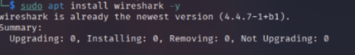
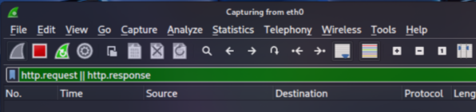
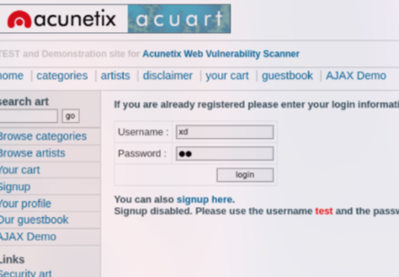
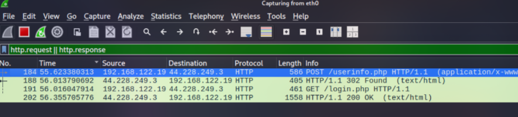
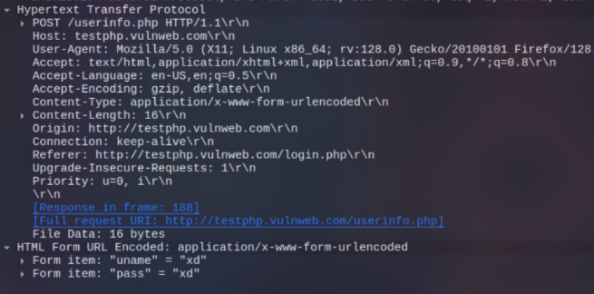

# Actividad Práctica: Captura y Análisis de Tráfico HTTP con Wireshark (Kali Linux)

##  Objetivo de la Actividad

Esta actividad tiene como objetivo proporcionar una experiencia práctica en la **captura y análisis de tráfico de red**, con un enfoque específico en las **conexiones HTTP**.

Los estudiantes aprenderán a usar **Wireshark** para **monitorear y analizar el tráfico generado durante una sesión web**, especialmente en el contexto de la **transmisión de datos a través de formularios**.

---

## Descripción Detallada

### 1. Preparación de la Herramienta

1. Instalar y configurar **Wireshark** en Kali Linux.
   En Kali, Wireshark suele venir preinstalado, pero se puede verificar e instalar con el siguiente comando:

   ```bash
   sudo apt update && sudo apt install wireshark -y
   ```
   

2. Durante la instalación, si se solicita, permitir que usuarios no root puedan capturar paquetes.

3. Familiarizarse con la interfaz gráfica de Wireshark: barra de filtros, panel de paquetes, detalles del paquete y bytes en bruto.

---

### 2. Captura de Tráfico

1. Abrir **Wireshark** desde el menú de aplicaciones o ejecutando:

   ```bash
   wireshark &
   ```

2. Seleccionar la interfaz de red adecuada para la captura (por ejemplo, `eth0`, `wlan0` o `lo` si se está probando localmente).

3. Configurar Wireshark para capturar solo tráfico HTTP. Para ello, usar el filtro:

   ```
   http
   ```
   


4. Iniciar la captura presionando el botón **Start Capturing Packets**.

---

### 3. Conexión a un Sitio Web

1. Abrir el navegador (por ejemplo, Firefox o Chromium) y acceder a un sitio HTTP, como:

   ```
   http://testphp.vulnweb.com/login.php
   ```



2. Completar el formulario de inicio de sesión con datos de prueba y enviarlo.

3. Mientras se realiza esta acción, Wireshark registrará el tráfico HTTP generado.

---

### 4. Análisis del Tráfico Capturado

1. Detener la captura en Wireshark una vez enviado el formulario.

2. Aplicar filtros para aislar la sesión web correspondiente. Por ejemplo:

   ```
   http.request || http.response
   ```


3. Examinar los paquetes **HTTP POST** para observar los datos enviados en el formulario.
   En las solicitudes HTTP no cifradas, los datos del formulario pueden verse en texto claro dentro del campo `HTML Form URL Encoded`.



---

### 5. Conclusiones


* Los formularios transmitidos por HTTP **no están cifrados**, lo que permite que un atacante pueda interceptar y leer los datos enviados, incluyendo nombres de usuario y contraseñas.

* Utilizar siempre **HTTPS** para proteger la confidencialidad de los datos.
* Implementar certificados SSL/TLS en los servidores web.
* Educar a los usuarios sobre los riesgos de enviar información sensible en sitios HTTP.

---

