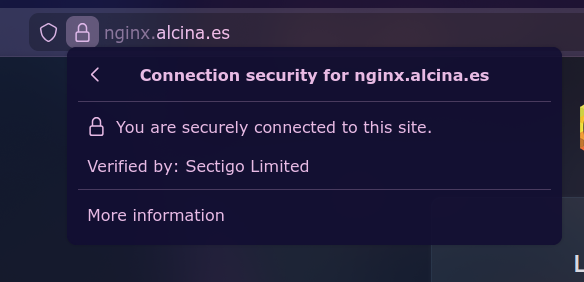
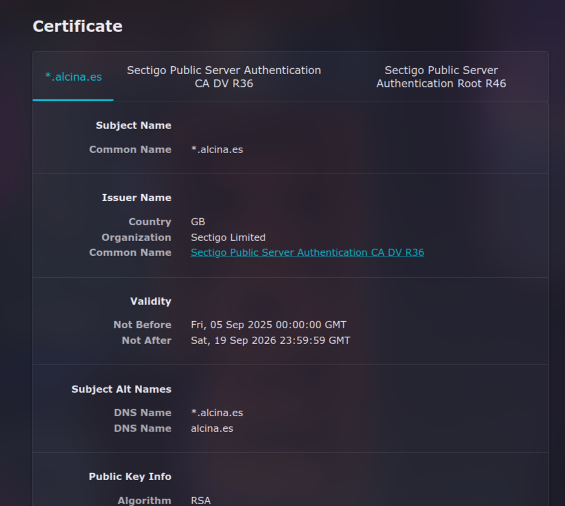
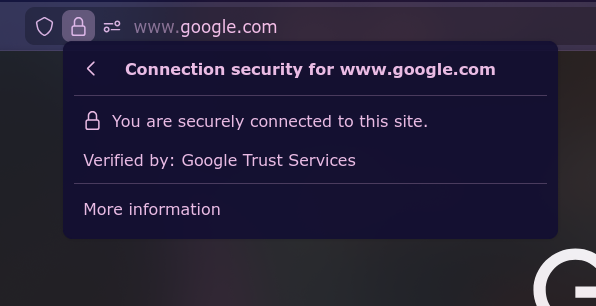
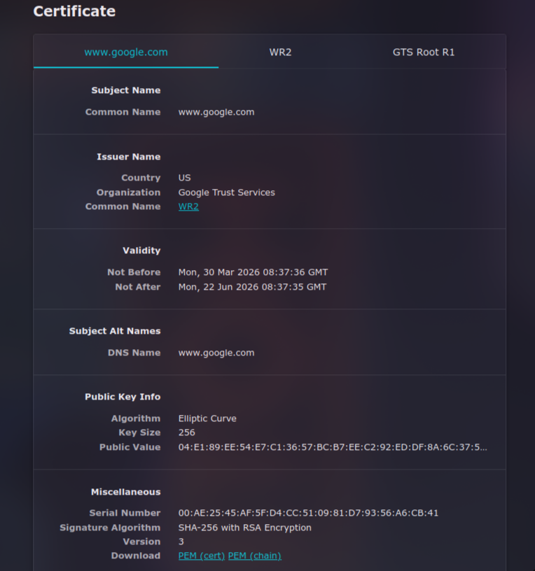

## Mi dominio

## Google

## Comparativa de Certificados Digitales (Vía Realista)

| Característica / Campo | Mi Certificado | Certificado Web Verificada (google.com) | Análisis / Diferencia Principal |
| :--- | :--- | :--- | :--- |
| **Estado en el Navegador** | Válido y seguro (Candado cerrado). | Válido y seguro (Candado cerrado). | Ambos son confiables porque sus emisores están en la lista de Autoridades de Certificación (CA) de confianza del navegador. |
| **Emitido para (Sujeto)** | `alcina.es` y sus subdominios | Solo para `www.google.com` | El mío cubre mi dominio personal, mientras que el verificado suele ser un dominio comercial |
| **Emitido por (Emisor / CA)** | Sectigo Limited  | Google Trust Services | Yo uso una CA gratuita proporcianda por IONOS. Las grandes webs suelen pagar a CAs comerciales que ofrecen garantías económicas y soporte dedicado. |
| **Periodo de Validez** | 380 días | 84 días | Let's Encrypt fuerza renovaciones cortas (90 días) para minimizar daños si la clave se ve comprometida. Los de pago suelen durar el máximo permitido por la industria (1 año) por comodidad administrativa. |
| **Algoritmo de Firma / Clave** | SHA-256 with RSA Encryption | SHA-256 with RSA Encryption | Suelen ser muy similares (ej. RSA de 2048 bits o superior). Las webs grandes a veces usan ECC porque es más rápido y consume menos recursos del servidor. |
