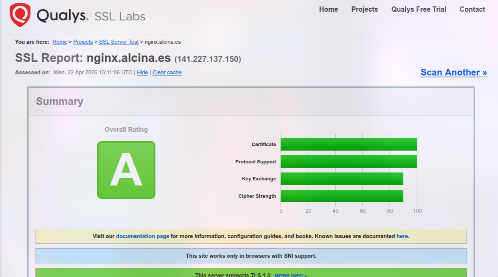
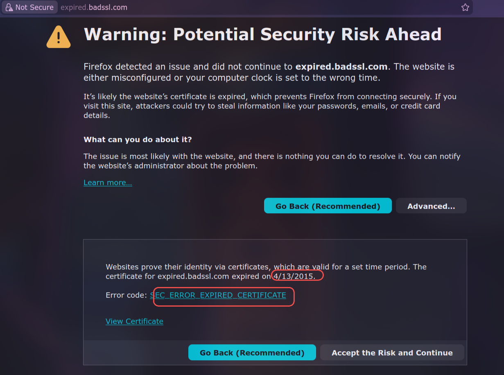
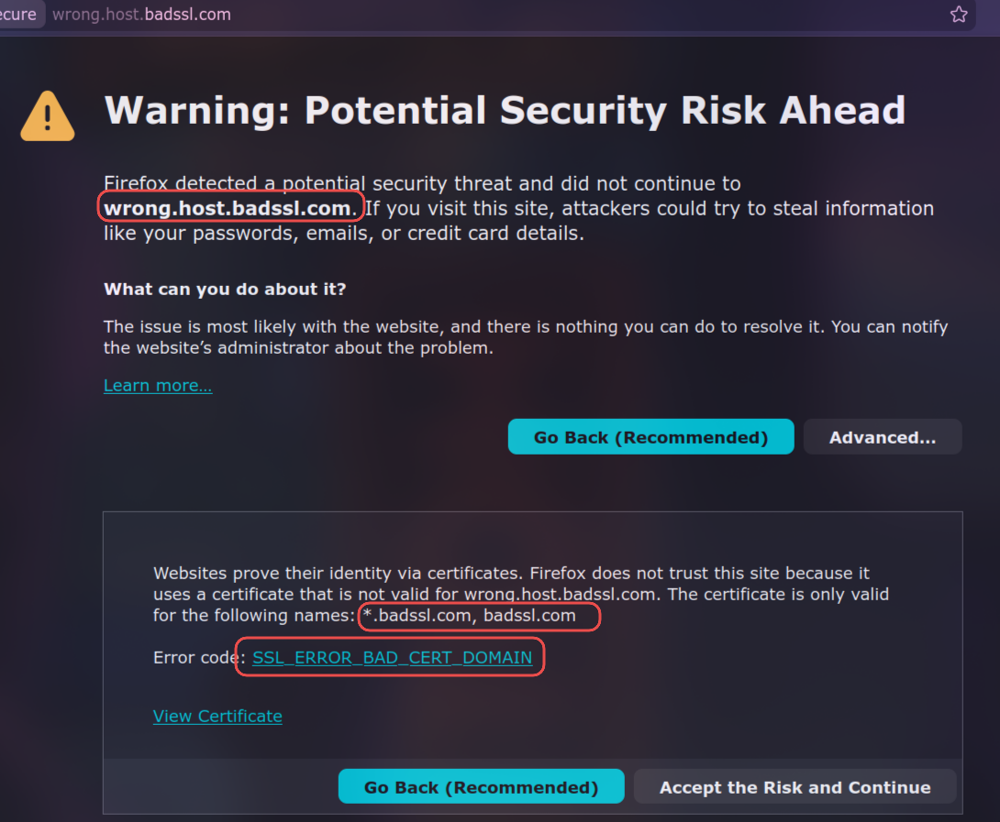
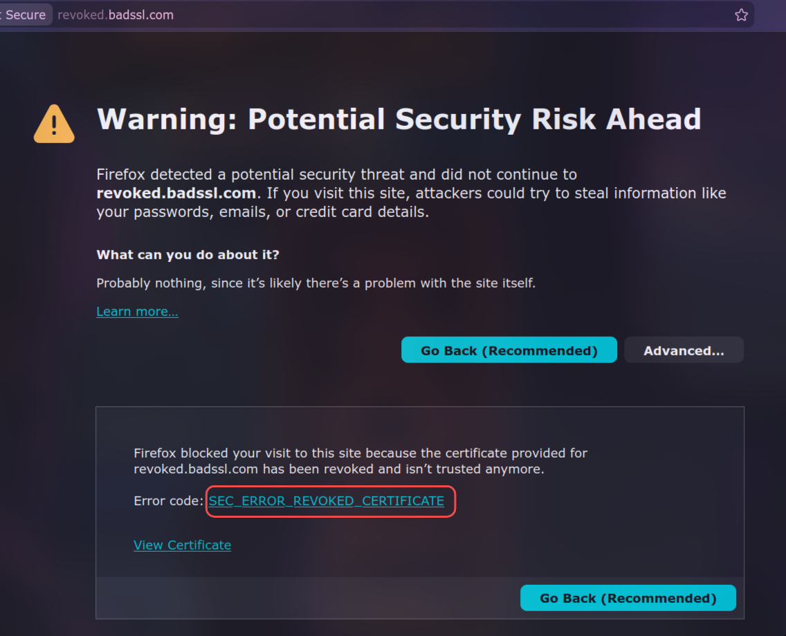

# Parte 3: Comprobación y Validez de Certificados Digitales

## 1. Análisis de Certificado Válido (Vía Realista - Mi Servidor)

**Sitio web analizado:** `nginx.alcina.es`
**Herramienta utilizada:** Qualys SSL Labs
**Calificación obtenida:** A

Al analizar mi servidor web con SSL Labs, el resultado confirma que el certificado y la configuración del servidor son completamente seguros y válidos por los siguientes motivos técnicos:

1.  **Autoridad de Certificación (CA) de Confianza:** El certificado ha sido emitido por *Sectigo Public Server Authentication CA DV R36*. Esta es una entidad reconocida y se encuentra en los almacenes de confianza de todos los navegadores y sistemas operativos principales (Mozilla, Apple, Android, Windows).
2.  **Validez Temporal Correcta:** El periodo de validez del certificado está vigente. Fue emitido el 5 de septiembre de 2025 y no caduca hasta el 19 de septiembre de 2026.
3.  **Coincidencia de Nombres (Subject/SAN):** El certificado es de tipo *Wildcard* (`*.alcina.es`) e incluye `alcina.es` como nombre alternativo, lo cual cubre perfectamente el subdominio visitado (`nginx.alcina.es`).
4.  **Criptografía Robusta:** Utiliza una clave RSA de 2048 bits y un algoritmo de firma robusto (SHA256withRSA), estándares actuales de la industria que garantizan que el certificado no puede ser falsificado.
5.  **Configuración de Protocolos:** El servidor está excelentemente configurado, rechazando protocolos obsoletos e inseguros (SSLv3, TLS 1.0, TLS 1.1) y forzando el uso de los protocolos más modernos (TLS 1.2 y TLS 1.3). Tampoco es vulnerable a ataques conocidos como Heartbleed o POODLE.

---

## 2. Análisis de Certificados Erróneos en Sitios Web

Para esta sección, se han analizado tres subdominios del proyecto *BadSSL*, diseñados específicamente para mostrar diferentes escenarios de fallo en la validación de certificados.

### 2.1. Certificado Caducado (Expired)
**Sitio web analizado:** `https://expired.badssl.com`

Este certificado es catalogado como no válido por un fallo en su ciclo de vida. Aunque la firma criptográfica es correcta y el dominio coincide, la fecha actual del sistema es posterior a la fecha **"Valid until" (Válido hasta)** especificada en el certificado. Los navegadores bloquean el acceso porque un certificado caducado indica que la identidad del sitio ya no está siendo validada activamente por la Autoridad de Certificación, y la clave privada podría haber estado expuesta durante demasiado tiempo.

### 2.2. Nombre de Dominio Incorrecto (Name Mismatch)
**Sitio web analizado:** `https://wrong.host.badssl.com`

El análisis revela un error de discrepancia de nombre (Name Mismatch). El certificado presentado por el servidor es técnicamente válido (fechas correctas y firmado por una CA de confianza), pero fue emitido para un dominio diferente (en este caso, suele ser `*.badssl.com`, que no ampara subdominios de segundo nivel como `wrong.host`). El navegador lo bloquea para prevenir ataques de *Man-in-the-Middle* (MitM), evitando que alguien intercepte la conexión usando un certificado legítimo que pertenece a otra página web.

### 2.3. Certificado Revocado (Revoked)
**Sitio web analizado:** `https://revoked.badssl.com`

Este certificado falla en la validación porque ha sido revocado explícitamente por su Autoridad de Certificación antes de alcanzar su fecha de caducidad. Durante el proceso de *Handshake* SSL/TLS, el navegador o el servicio de análisis comprueban el estado del certificado usando los protocolos CRL (Listas de Revocación) u OCSP. Al comprobar este certificado, la CA responde que ya no es de confianza. Esto suele ocurrir cuando el propietario del sitio web reporta que su clave privada ha sido robada o comprometida, haciendo que el certificado deje de ser seguro inmediatamente.