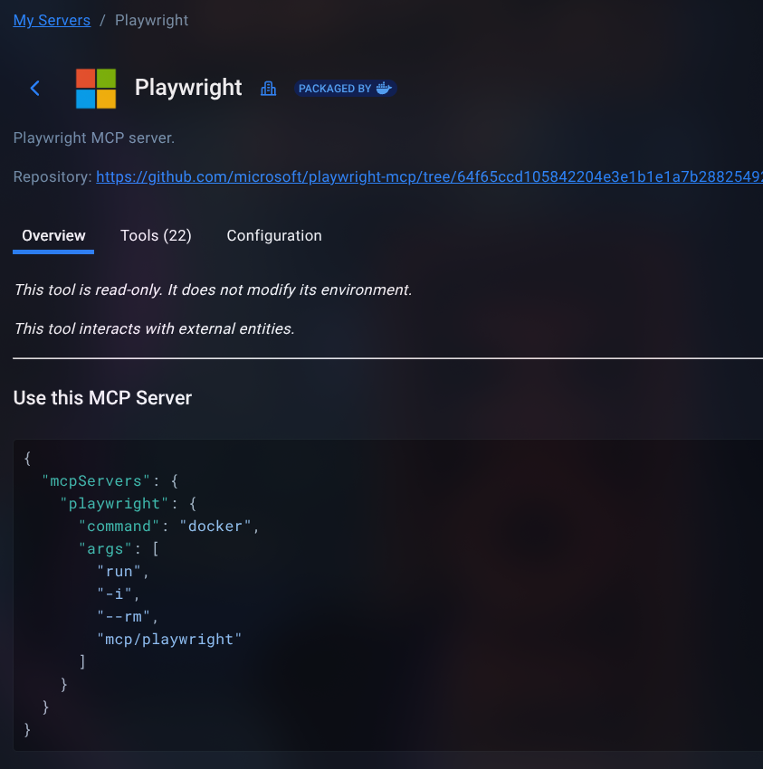
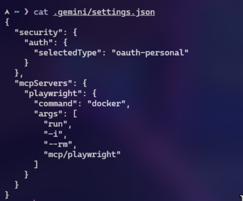
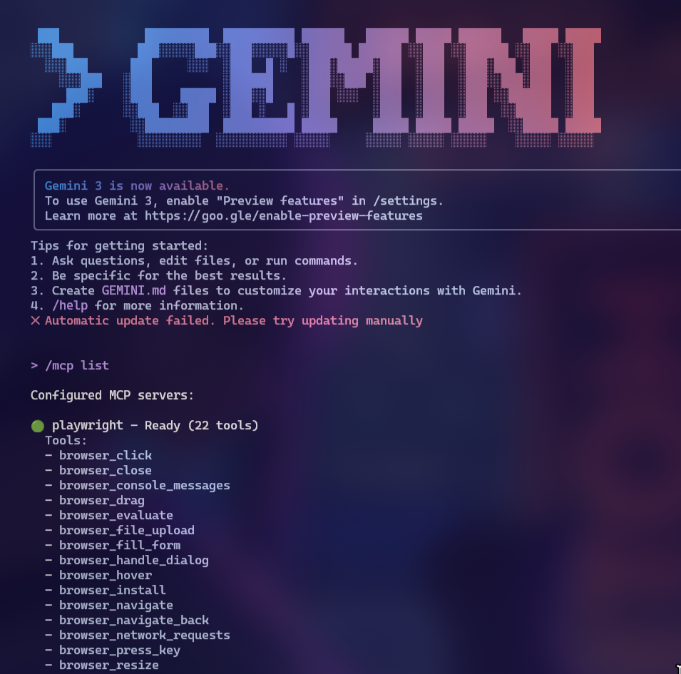

# Uso de IA Agéntica con `gemini-cli` y Playwright MCP

Este documento describe los pasos que he seguido para usar agentes de IA con **Gemini CLI** y el servidor **Playwright MCP**, tal y como se ve en las capturas adjuntas.

## 1. Instalación y configuración básica de Gemini CLI

1. Instalé la herramienta de línea de comandos de Gemini (Gemini CLI).
2. Al ejecutar `gemini` por primera vez, configuré la autenticación con mi cuenta de Google (modo `oauth-personal`), que queda registrada en el fichero `~/.gemini/settings.json` bajo el bloque `security.auth`.


## 2. Integración de un servidor MCP: Playwright



Para dotar a Gemini de capacidades de automatización de navegador, integré el **Playwright MCP server** empaquetado en Docker.

El bloque que añadí en: `~/.gemini/settings.json`.


```json
"mcpServers": {
  "playwright": {
    "command": "docker",
    "args": [
      "run",
      "-i",
      "--rm",
      "mcp/playwright"
    ]
  }
}
```




## 3. Verificación del servidor MCP en Gemini CLI

Una vez modificada la configuración, comprobé que Gemini detectaba correctamente el servidor MCP:

1. Ejecuté en el CLI:

```bash
gemini
> /mcp list
```



2. El comando listó los servidores MCP configurados, mostrando:
   - `playwright – Ready (22 tools)`

3. En la salida se enumeran las herramientas que expone el servidor Playwright, por ejemplo:
   - `browser_click`
   - `browser_close`
   - `browser_evaluate`
   - `browser_navigate`
   - `browser_network_requests`
   - etc.

Esto confirma que el agente de Gemini puede llamar a Playwright como proveedor externo de herramientas.

## 4. Uso práctico de la IA agéntica con herramientas MCP

Después de tener el servidor Playwright activo, probé el funcionamiento de la IA agéntica pidiéndole tareas que requieren usar herramientas externas.

Un ejemplo que se ve en las capturas es una consulta a la web:

```text
buscame las noticias mas impactantes de esta semana en cadiz
```

La conversación muestra:

1. El modelo decide usar una herramienta de búsqueda web (por ejemplo `GoogleSearch`) como parte de su conjunto de herramientas MCP.
2. En la traza se ve algo como:
   - `✓ GoogleSearch Searching the web for: "noticias más destacadas Cádiz última semana"`
3. A continuación, el agente resume las noticias encontradas, agrupadas por temática (narcotráfico, industria y empleo, deportes, sucesos, medio ambiente, turismo, etc.).

Este flujo ilustra el enfoque **agéntico**: el modelo no solo genera texto, sino que:
- Decide qué herramienta MCP utilizar.
- Llama a la herramienta (navegador Playwright u otras, como buscadores).
- Procesa los resultados y devuelve un resumen natural al usuario.

## 5. Resumen de lo conseguido

- He configurado **Gemini CLI** con autenticación personal (`oauth-personal`).
- He añadido el servidor **Playwright MCP** usando Docker en `~/.gemini/settings.json`.
- He verificado desde el comando `/mcp list` que el servidor `playwright` está **Ready** y expone 22 herramientas.
- He utilizado la IA de Gemini como **agente**, capaz de:
  - invocar herramientas MCP (por ejemplo, buscadores o navegador vía Playwright),
  - recuperar información externa,
  - y generar respuestas resumidas y contextualizadas para el usuario.

